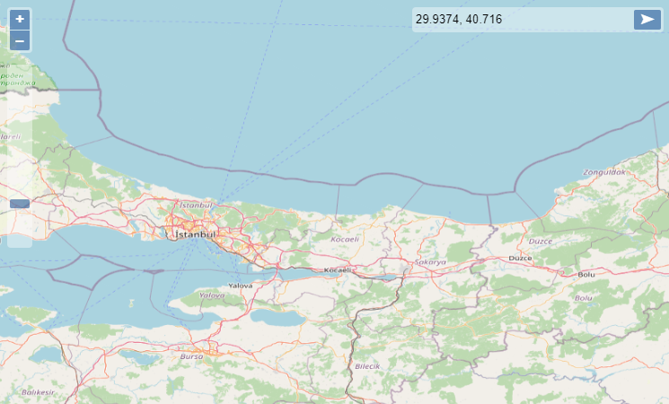

# Coordinate Control for OpenLayers 🎯


[](https://github.com/bugraaydin1/)

> Add coordinates control over OpenLayers map. The coordinate entered is evaluated as the current view's projection and centered on the map. If the view's projection changes, coordinate will be expected in latter projection.



## Install

```sh
npm install ol-coords
```

## Usage

There is 3 ways of using this control in your project:

#### React (etc.)

Install `ol` package if not already installed

```sh
npm install ol
```

Use the control as:

[codesandbox demo](https://codesandbox.io/s/ol-coords-react-4xxqd)

```jsx
import React, { useEffect } from "react";
import CoordsControl from "ol-coords/dist/ol-coords";
...
import "ol/ol.css";

function App() {
	useEffect(() => {
		new Map({
			target: "map",
			layers: [
				new TileLayer({
					source: new OSM(),
				}),
			],
			controls: [
				new ZoomSlider(),
				new CoordsControl({ placeholder: "Fly to coords" }),
			],
			view: new View({
				zoom: 7,
				center: [34, 39],
				projection: getProjection("EPSG:4326"),
			}),
		});
	}, []);

	return (
		<div>
			<h2>OpenLayers Coords Control - for React</h2>
			<div id="map" className="map" />
		</div>
	);
}

export default App;
```

##### parameters:

placeholder: [String](https://developer.mozilla.org/en-US/docs/Web/JavaScript/Reference/Global_Objects/String)

#### CDN (without bundler)

[codesandbox demo](https://codesandbox.io/s/ol-coords-cdn-sknhv)

- Create `index.html` file and load OpenLayers javascript & css file from CDN.
- Create `map.js` and load this script as `type="module"` in `index.html`

```html
<link
	rel="stylesheet"
	href="https://cdn.jsdelivr.net/gh/openlayers/openlayers.github.io@master/en/v6.9.0/css/ol.css"
	type="text/css"
/>
<script src="https://cdn.jsdelivr.net/gh/openlayers/openlayers.github.io@master/en/v6.9.0/build/ol.js"></script>

<body>
	<h2>Coordinate Control Map</h2>
	<div id="map" class="map"></div>
	<script type="module" src="map.js"></script>
</body>
```

Finally, `import` CoordsControl where you define the map as we do in `map.js`:

```javascript
import CoordsControl from "https://cdn.skypack.dev/-/ol-coords@v1.0.1-sXJYhG5Btz3WYSzwvHZH/dist=es2020,mode=imports/optimized/ol-coords.js";

new ol.Map({
	target: "map",
	layers: [
		new ol.layer.Tile({
			source: new ol.source.OSM(),
		}),
	],
	controls: ol.control.defaults({ attribution: true }).extend([
		new ol.control.ZoomSlider(),
		new CoordsControl({
			placeholder: "Fly to coordinates",
		}),
	]),
	view: new ol.View({
		zoom: 7,
		center: [34, 39],
		projection: ol.proj.get("EPSG:4326"),
	}),
});
```

##### parameters:

placeholder: [String](https://developer.mozilla.org/en-US/docs/Web/JavaScript/Reference/Global_Objects/String)

- [This](#cdn-without-bundler) method can be used only on modern browsers supporting ES Modules.

#### CDN (with bundler - Parcel, Webpack, Browserify etc.)

- Create `index.html` and `map.js` files as shown in [CDN (without bundler)](#cdn-without-bundler).
- Only `import` source of `CoordsControl` is different from in [CDN (without bundler)](#cdn-without-bundler).

`import` CoordsControl from `node_modules` where you define the map as we do in `map.js`:

```javascript
import CoordsControl from "./node_modules/ol-coords/dist/cdn/ol-coords-cdn.js";

// define ol.Map same as in CDN (without bundler)
```

##### parameters:

placeholder: [String](https://developer.mozilla.org/en-US/docs/Web/JavaScript/Reference/Global_Objects/String)

_For browsers to understand `import` statement, you need to use a bundler._

#### _Parcel_

- You can install parcel running `npm i --save-dev parcel`

- Then just run `parcel index.html` to open the app in browser: http://localhost:1234/

## Author

👤 **bugraaydin1**

- Github: [@bugraaydin1](https://github.com/bugraaydin1)

## 🤝 Contributing

Contributions, issues and feature requests are welcome: [issues page](https://github.com/bugraaydin1/ol-coords/issues).
